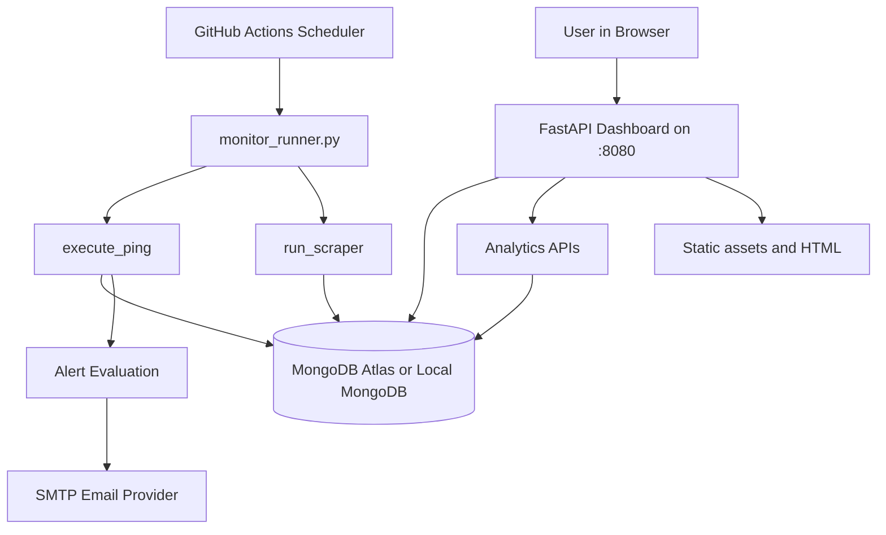
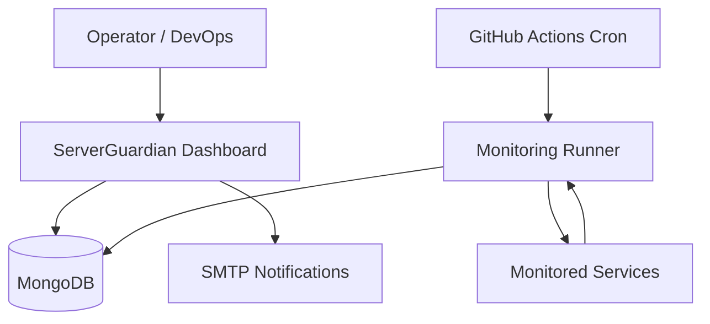
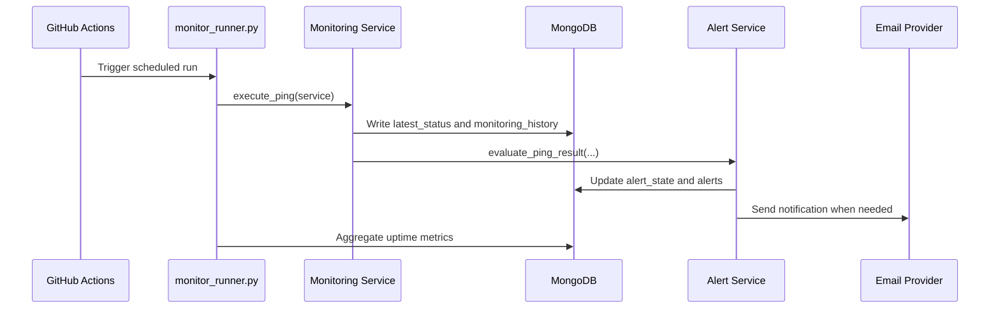
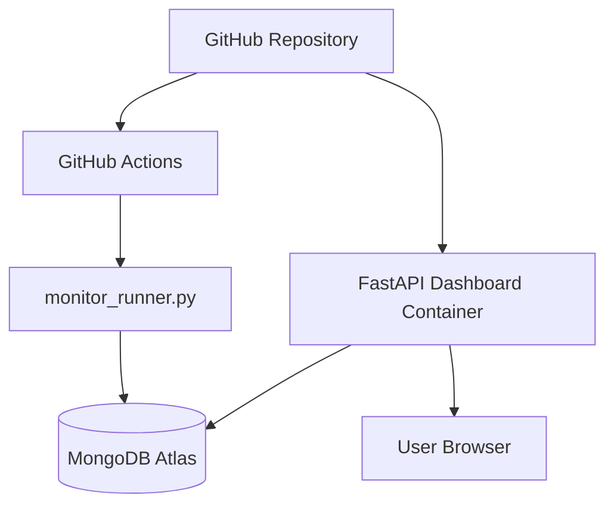

# ServerGuardian

ServerGuardian is a production-oriented Python monitoring platform for keeping multiple backend services alive, collecting health telemetry, detecting incidents, and surfacing historical reliability analytics from MongoDB.

It combines three main pieces:

* a FastAPI dashboard for live status and analytics
* a GitHub Actions monitoring runner for scheduled checks
* a MongoDB-backed data layer for logs, incidents, and uptime metrics

The current project is designed around monitored servers and an optional scraping worker.

## What This Project Does

ServerGuardian continuously:

* pings configured HTTP health endpoints
* records latency, status codes, and response snippets
* parses nested health signals for selected services
* runs a stock-scraping worker during market hours
* caches and aggregates uptime metrics
* raises incident alerts and recovery notifications
* exposes analytics APIs for uptime, latency, ranking, and platform health
* serves a glassmorphism-style dashboard for operators

## Architecture



## Product Views

### System Context



### Monitoring Lifecycle



### Deployment Topology



## Key Capabilities

### Monitoring

* Scheduled HTTP checks for each configured service
* Request latency measurement in milliseconds
* HTTP status classification into success, failure, error, or skipped
* Service schedule enforcement using Asia/Kolkata time
* Per-service runtime metadata in MongoDB

### Alerting

* Service-down alerts
* Recovery alerts
* High-latency alerts
* Database and cache sub-component failure alerts for parsed services
* Health-score degradation alerts
* Duplicate suppression and basic rate limiting

### Analytics

* Uptime by service and time window
* Latency percentiles: average, min, max, median, P95, P99
* Daily trend series
* Cross-service reliability ranking
* Service reliability reports
* Platform-wide executive summary

### Scraping

* Stock scraping via Screener.in
* Optional market-hour-only execution
* Upserts into the `investiqdb.Stocks` collection

## Repository Layout

* `main.py` - starts the dashboard server and initializes MongoDB indexes
* `dashboard.py` - FastAPI app with dashboard routes and analytics endpoints
* `monitor_runner.py` - scheduled runner used by GitHub Actions
* `config.py` - service definitions and environment-driven settings
* `services/monitoring_service.py` - ping execution and persistence
* `services/scraper_service.py` - stock scraping job wrapper
* `services/analytics_service.py` - analytics and reporting queries
* `services/alert_service.py` - alert evaluation logic
* `services/notification_service.py` - alert state management and email dispatch
* `services/uptime_service.py` - uptime helpers and outage detection
* `services/uptime_aggregator.py` - cached uptime metrics aggregation
* `services/email_provider.py` - SMTP email templates and sending
* `servers/stock_scraper_service.py` - stock scraping implementation
* `templates/index.html` - dashboard HTML shell
* `static/js/charts.js` - chart rendering helpers
* `models/analytics.py` - Pydantic response models
* `scripts/migrate_monitoring_history.py` - legacy history migration utility

## Runtime Flow

1. GitHub Actions starts `monitor_runner.py` every 5 minutes.
2. The runner loads `SERVICES_CONFIG` from `config.py`.
3. Each enabled service is processed in its own thread.
4. Pinger services call `execute_ping`.
5. Scraper services call `run_scraper`.
6. Results are written to MongoDB collections.
7. Alert rules are evaluated and emails are sent if configured.
8. Uptime metrics are aggregated into the cached `uptime_metrics` collection.
9. The dashboard reads the latest state and analytics directly from MongoDB.

## Data Model

The project uses MongoDB as the central source of truth.

### Databases

* `ServerAutomation`
* `investiqdb`

### Main Collections

* `latest_status`
* `monitoring_history`
* `health_logs`
* `uptime_metrics`
* `alerts`
* `alert_state`
* `github_actions_status`
* `Stocks`

### What Each Collection Stores

* `latest_status` stores the current visible state for each service
* `monitoring_history` stores long-term check history for analytics
* `health_logs` stores detailed ping execution logs with response snippets
* `uptime_metrics` stores cached multi-window uptime values
* `alerts` stores alert history and delivery state
* `alert_state` stores incident suppression and recovery context
* `github_actions_status` stores the last runner execution result
* `Stocks` stores scraped stock snapshots

## Configured Services

Service definitions live in `config.py` and are environment-driven.

### Pinger Services

* monitored server endpoints defined in `config.py`

### Scraper Service

* `stock_scraper` when `ENABLE_STOCK_SCRAPER` is enabled

### Schedule Rules

* Most pinger services run every 10 minutes
* `stock_scraper` is scheduled every 15 minutes by the runner
* Service execution is constrained by allowed hours and days in IST
* selected monitored servers are treated as 24/7 services
* some monitored servers are allowed between 09:00 and 02:00 IST, crossing midnight

## API Surface

The dashboard exposes both UI and JSON APIs.

### UI Routes

* `GET /` returns the dashboard HTML
* `/public/*` serves static images and assets
* `/static/*` serves JavaScript assets

### Status and Logs

* `GET /api/status` returns the latest state for all configured services
* `GET /api/logs` returns a merged recent activity feed
* `POST /api/ping/{service_name}` triggers a background ping or scraper run
* `GET /api/github-actions/status` returns the last GitHub Actions runner state

### Uptime and Incident APIs

* `GET /api/services/{id}/uptime` returns cached service uptime metrics
* `GET /api/uptime/overview` returns overall platform reliability
* `GET /api/uptime/history` returns 30-day daily availability history
* `GET /api/alerts` returns active incidents and alert history
* `GET /api/alerts/analytics` returns alert counts and recovery metrics

### Analytics APIs

* `GET /api/analytics/uptime/{service_id}?days=30`
* `GET /api/analytics/latency/{service_id}?days=30`
* `GET /api/analytics/trend/{service_id}?days=30`
* `GET /api/analytics/ranking?days=30`
* `GET /api/analytics/reliability/{service_id}`
* `GET /api/analytics/platform?days=30`

### Response Model Notes

The analytics layer is backed by Pydantic models in `models/analytics.py`, including:

* `UptimeStats`
* `LatencyStats`
* `ReliabilityReport`
* `ServiceRanking`
* `PlatformSummary`

## Environment Variables

### Required

* `MONGO_URI` - MongoDB connection string used by both the dashboard and the runner
...& others if anyone want so [Contact: Mail](mailto:ujjwalsaini0007+server@gmail.com)

### Optional Email Alerting

* `EMAIL_HOST`
* `EMAIL_PORT` - defaults to `587`
* `EMAIL_USER`
* `EMAIL_PASSWORD`
* `EMAIL_FROM`
* `ALERT_RECIPIENTS`

If email settings are incomplete, alerts are still logged to MongoDB, but email delivery is skipped safely.

## Local Development

### Prerequisites

* Python 3.11 or newer
* MongoDB Atlas or a local MongoDB instance
* Network access to the monitored service URLs

### Install

```bash
python -m pip install -r requirements.txt
```

### Configure

Create a `.env` file in the project root and define at least:

```env
MONGO_URI=mongodb://localhost:27017
...& others
```

If you want email alerts, add:

```env
EMAIL_HOST=smtp.gmail.com
EMAIL_PORT=587
EMAIL_USER=alerts@example.com
EMAIL_PASSWORD=your-app-password
ALERT_RECIPIENTS=ops@example.com,dev@example.com
```

### Run the Dashboard

```bash
python main.py
```

The dashboard starts on:

* `http://localhost:8080`

### Run One Monitoring Cycle Manually

```bash
python monitor_runner.py
```

This is the same job that GitHub Actions runs on schedule.

### Optional Migration

If you have older `monitoring_history` documents written by a legacy schema, run:

```bash
python scripts/migrate_monitoring_history.py
```

The migration is idempotent and only touches legacy rows that do not yet have `service_id`.

## Docker

The repository includes a simple Dockerfile and Compose setup.

### Build and Run

```bash
docker compose up --build
```

### Container Behavior

* the container runs `python main.py`
* port `8080` is exposed
* `firebase_key.json` is mounted read-only at `/app/firebase_key.json`
* `GOOGLE_APPLICATION_CREDENTIALS` is set to that mounted path

## GitHub Actions

The workflow lives at `.github/workflows/serverguardian-monitor.yml`.

### Behavior

* runs every 5 minutes
* supports manual `workflow_dispatch`
* installs dependencies with `pip`
* runs `python monitor_runner.py`
* reads all required secrets from GitHub Actions secrets

### Required Secrets

* `MONGO_URI`
... & others

## Dashboard Experience

The dashboard UI in `templates/index.html` and `static/js/charts.js` provides:

* live service tiles
* search and status filters
* uptime trend charts
* uptime distribution visualization
* reliability leaderboard
* service-level reliability modal
* platform analytics overview
* terminal-style event stream

The UI is intentionally dark, glassmorphic, and operator-focused.

## Stock Scraper Notes

The stock scraper:

* reads tickers from `servers/IndianStockTicker.json`
* fetches Screener.in pages with `requests`
* extracts metrics such as market cap, price, P/E, dividend yield, ROCE, ROE, and face value
* stores results in `investiqdb.Stocks`
* respects weekday and intraday schedule constraints

Because the scraper pulls public web pages, it can fail if the remote site changes layout or rate limits requests.

## Reliability and Analytics Design

The analytics engine in `services/analytics_service.py` is optimized around `monitoring_history` as the single source of truth.

Important behaviors:

* aggregation pipelines are used instead of loading all documents into Python
* service ranking is computed across all configured services
* trend indicators compare 24-hour uptime against 7-day uptime
* consecutive outage detection checks the last three runs
* platform summary calculates cross-service uptime and latency metrics
* reliability thresholds are controlled by environment variables

## Operational Considerations

* MongoDB indexes are created on startup for analytics and TTL cleanup
* `health_logs` uses TTL expiration for pinger log retention
* alert emails are rate-limited and incident-suppressed to avoid spam
* dashboard reads are non-destructive and do not modify the monitoring state
* the system is tolerant of missing data and defaults to `100.0` when history is absent

## Troubleshooting

### Dashboard Shows `PENDING`

* confirm `MONGO_URI` is correct
* verify the runner has already written to `latest_status`
* check that the service URLs are reachable

### Email Alerts Are Not Sending

* confirm all SMTP variables are set
* ensure `ALERT_RECIPIENTS` contains at least one valid address
* verify the SMTP provider allows app-password or authenticated SMTP delivery

### GitHub Actions Runs But No Metrics Appear

* verify repository secrets are populated
* confirm the monitored service endpoints return valid JSON or HTTP responses
* inspect `github_actions_status` in MongoDB

### Stock Scraper Does Nothing

* confirm `ENABLE_STOCK_SCRAPER=true`
* verify the current time is within the allowed IST trading window
* check that `servers/IndianStockTicker.json` exists and is readable

### Analytics Look Empty

* confirm `monitoring_history` contains service documents with `service_id`
* run the migration script if the collection still contains legacy rows
* make sure the dashboard and runner are both pointing to the same MongoDB cluster

## Security Notes

* Do not commit real secrets into the repository
* Use MongoDB Atlas IP access rules appropriate for your deployment
* Prefer GitHub Secrets for runner credentials
* Treat public health endpoints as untrusted inputs when extending parsers

## Author & System Architect

**Ujjwal Saini**  
Founder, Lead Engineer & System Architect

Passionate Full-Stack Engineer specializing in AI-powered systems, real-time analytics, secure database designs, and scalable platform architectures. Focused on building production-grade solutions that transform raw operational data into actionable business intelligence. Ujjwal brings bold ideas to life through stunning interfaces and seamless user experiences, always chasing clarity in every interaction.

For ServerGuardian, Ujjwal designed and implemented the complete end-to-end platform - from MongoDB-backed monitoring history and alert state management to GitHub Actions scheduling, analytics pipelines, and the operator dashboard.

### Contact & Links

* Portfolio: [ujjwalsaini.vercel.app](https://ujjwalsaini.vercel.app)
* GitHub: [github.com/UjjwalSaini07](https://github.com/UjjwalSaini07)
* LinkedIn: [linkedin.com/in/ujjwalsaini07](https://www.linkedin.com/in/ujjwalsaini07)
* Email: [ujjwalsaini0007+server@gmail.com](mailto:ujjwalsaini0007+server@gmail.com)

## License

This project is distributed under the terms of the repository MIT license.
